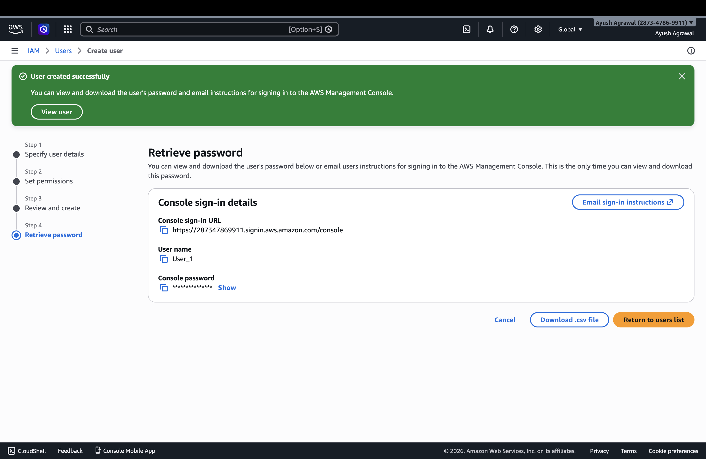
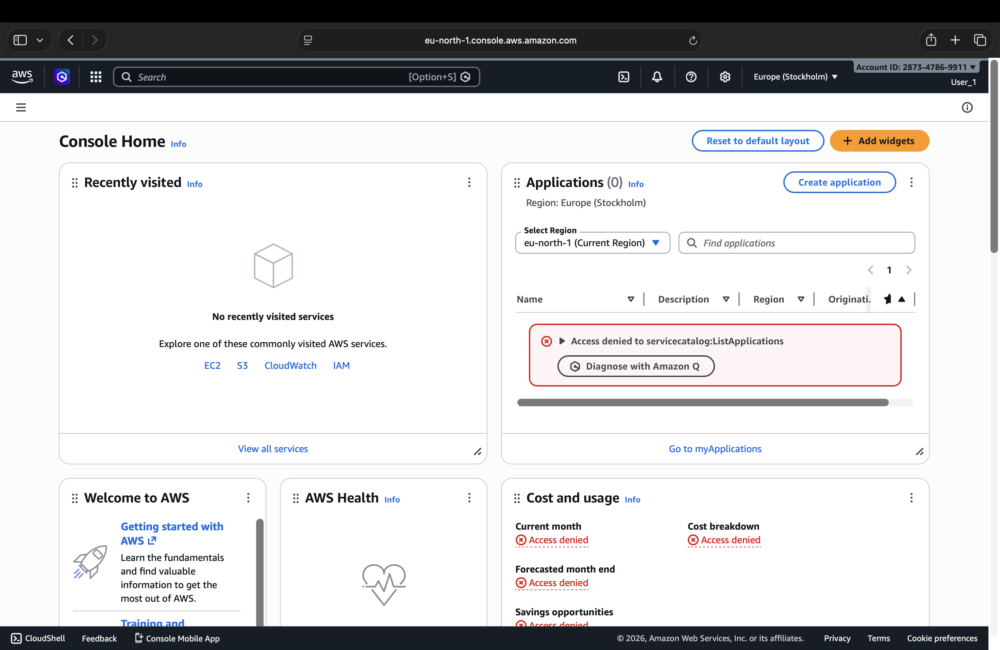
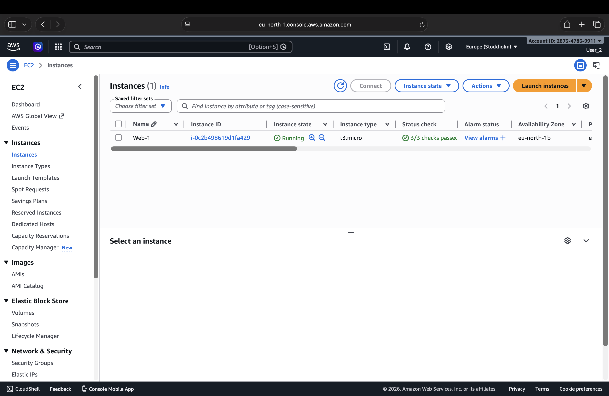

# 🚀 AWS EC2 Static Website Hosting with IAM Access Control

## 👨‍💻 Student Details
- **Name:** Ayush Agrawal  
- **Course:** B.Tech CSE  
- **Assignment:** AWS EC2 Static Website Hosting  
- **Platform:** Cipher Schools  

---

## 🌐 Deployed Website Link
👉 http://YOUR_ELASTIC_IP  

*(Replace with your Elastic IP)*

---

## 🖥️ EC2 Instance Details
- **Instance Type:** t2.micro (Free Tier)  
- **Operating System:** Ubuntu 24.04  
- **Web Server:** Apache2  
- **Region:** eu-north-1  

---

## ⚙️ Steps Performed

### 🔹 1. EC2 Setup & Website Hosting
- Launched an EC2 instance on AWS  
- Connected using SSH with `.pem` key  
- Installed Apache2  
- Deployed TemplateMo static website  
- Hosted files in `/var/www/html`  

---

### 🔹 2. Elastic IP Configuration
- Allocated Elastic IP  
- Associated it with EC2 instance  
- Used Elastic IP for permanent public access  

---

### 🔹 3. IAM User Setup

#### 👤 User 1 (No Permissions)
- No policies attached  
- ❌ Cannot view EC2  

#### 👤 User 2 (With EC2 Access)
- Policy: `AmazonEC2FullAccess`  
- ✅ Can view and manage EC2  

---

## 📸 Screenshots

### 🖥️ EC2 Instance (Username visible)

---

### 🌐 Deployed Website

---

### 👤 IAM User 1 (No Access)

---

### 👤 IAM User 2 (With Access)

---

## ⚠️ Challenges Faced

- SSH key path issues  
- Permission denied errors  
- Apache showing "Index of /"  
- Security group misconfiguration  
- Public IP changing  

---

## ✅ Solutions Implemented

- Fixed SSH key path  
- Verified correct key pair  
- Corrected file structure  
- Opened required ports (22, 80)  
- Assigned Elastic IP  

---

## 🎯 Learning Outcomes

- AWS EC2 setup & management  
- Static website deployment  
- IAM user access control  
- Networking & security basics  

---

## 📅 Submission Details

- **Deadline:** 19 April 2026  
- **Status:** ✅ Completed  

---
